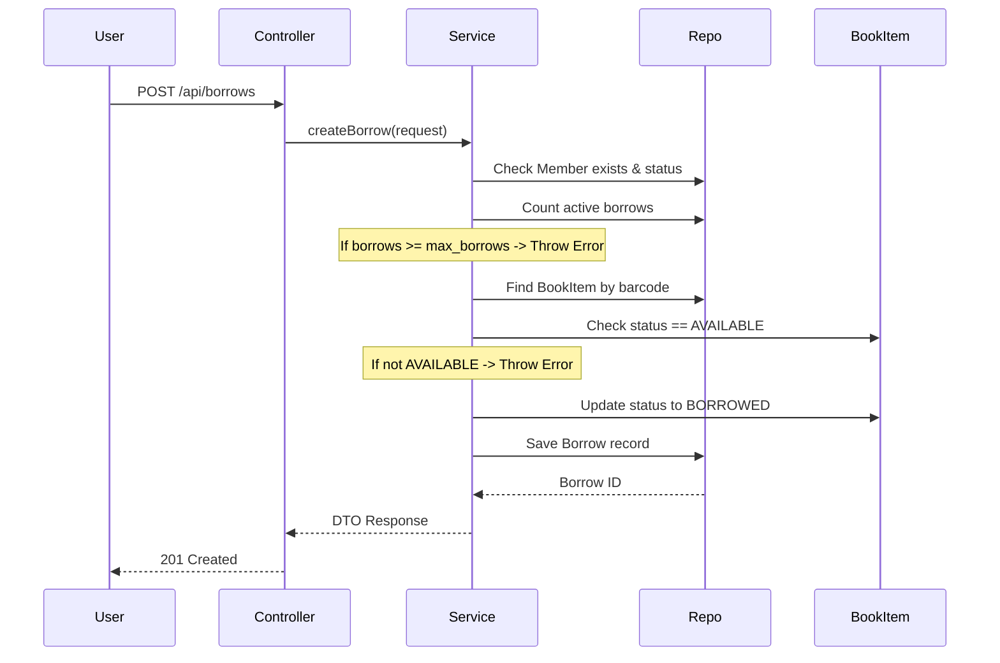

# 📚 Library Management System — Backend API


Bienvenue dans le backend professionnel du système de gestion de bibliothèque de **SUPNUM**. Cette application est conçue pour gérer avec précision le cycle de vie des livres, des membres et des transactions (emprunts et réservations).

---

## 🚀 Démarrage Rapide

### 1. Prérequis
- Java 21+
- Maven 3.6+
- MySQL 8.0+

### 2. Accès à la Documentation Interactive
Une fois l'application lancée, vous pouvez explorer et tester l'API via **Swagger UI** :
👉 [http://localhost:8080/swagger-ui/index.html](http://localhost:8080/swagger-ui/index.html)

---

## 🛠 Architecture & Technologies

- **Framework** : Spring Boot 3
- **ORM** : Spring Data JPA / Hibernate
- **Database** : MySQL
- **Documentation** : SpringDoc OpenAPI (Swagger)
- **Validation** : Jakarta Bean Validation
- **Audit** : JPA Auditing (Auto-timestamps)

---

## 📊 Modèle Conceptuel de Données (MCD)

| Entité | Type | Champs clés |
|--------|------|-------------|
| `language` | Référence | `code` PK, `name` |
| `nationality` | Référence | `code` PK, `name` |
| `category` | Principale | `id`, `name` UK, soft-delete |
| `publisher` | Principale | `id`, `name` UK, `email` UK, soft-delete |
| `author` | Principale | `id`, `name`, `nationality_code` FK, soft-delete |
| `book` | Principale | `id`, `title`, `isbn` UK, `language_code` FK, `category_id` FK, `publisher_id` FK, soft-delete |
| `book_author` | Jointure | `book_id` PK+FK, `author_id` PK+FK, `role` ENUM |
| `book_item` | Principale | `id`, `barcode` UK, `status` ENUM, `version` (optimistic lock), soft-delete |
| `member` | Principale | `id`, `email` UK, `member_type` ENUM, `max_borrows`, soft-delete |
| `reservation` | Transaction | `id`, `member_id` FK, `book_id` FK, `queue_position`, `status` ENUM |
| `borrow` | Transaction | `id`, `member_id` FK, `book_item_id` FK, `renewal_count` (max 3), `status` ENUM |

### Relations
- `Language` → `Book` : 1-N
- `Nationality` → `Author` : 1-N  
- `Category` → `Book` : 1-N
- `Publisher` → `Book` : 1-N
- `Book` ↔ `Author` via `BookAuthor` : N-N
- `Book` → `BookItem` : 1-N
- `Member` → `Borrow` : 1-N
- `BookItem` → `Borrow` : 1-N
- `Member` → `Reservation` : 1-N
- `Book` → `Reservation` : 1-N
- `Reservation` → `Borrow` : 0..1-1

---

## 🔄 Flux d'Emprunt (Sequence Diagram)

Visualisation du processus complexe de validation et de création d'un emprunt :



---

## 📂 Structure du Projet

```text
mr.supnum.library_app
├── config/        # Configuration (OpenAPI, JPA Auditing)
├── controller/    # Points d'entrée REST
├── dto/           # Objets de transfert de données (Request/Response)
├── entity/        # Modèles JPA & Enums
├── exception/     # Gestion globale des erreurs
├── repository/    # Accès aux données (Spring Data JPA)
└── service/       # Logique métier et validation
```

---

